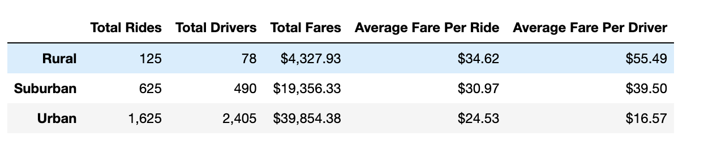
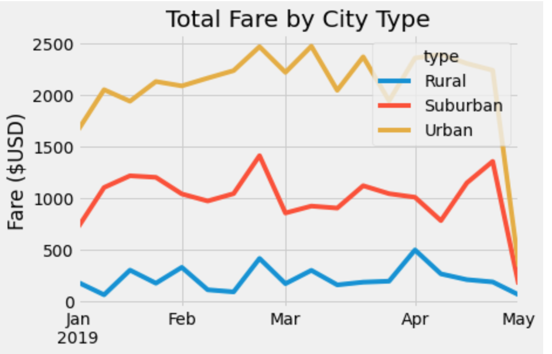

# PyBer Analysis

## Overview of ride-sharing data
Snapshot of ride sharing data by city type. Summary Report based on V.Isualize's requirenments.

### Purpose
The purpose of the project is to analyze all the rideshare data from January to early May of 2019 and create a compelling visualization for the CEO, V. Isualize.
The data includes: 
- The city data
- The ride data

## Technical Analysis Results

### Analysis based on a ride-sharing summary by city type

As per the ride sharing analysis done on differnt city type. Urban has the maximum number of rides and drivers. However, driver earned least fare per ride. Rural has the least number of total rides, but earned the maximum average fare per ride.

###  A multiple-line chart of total fares for each city type

Drivers earned least in the month of January and most between mid-February.  

## PyBer Summary

This explains the summary of the ride sharing data by city type. It summarizes how the data differs by city type and how those differences can be used by decision-makers at PyBer.
The following are the three recommendations:
- In the beginning of March, there are less rides in Suburban area than in Urban area. If suburban driver drives in Urban area, their earnings may increase.
- Rural drivers earn less beginning April. If they drive in Urban or Suburban area, their earning may increase.
- Even though average fare per ride for Rural drivers is high, they are not earning as much as Urban or Suburban drivers. One of the suggestion is to increase Rural fare further to help them come closer to other city types.

